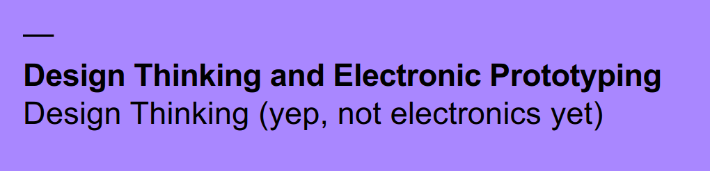
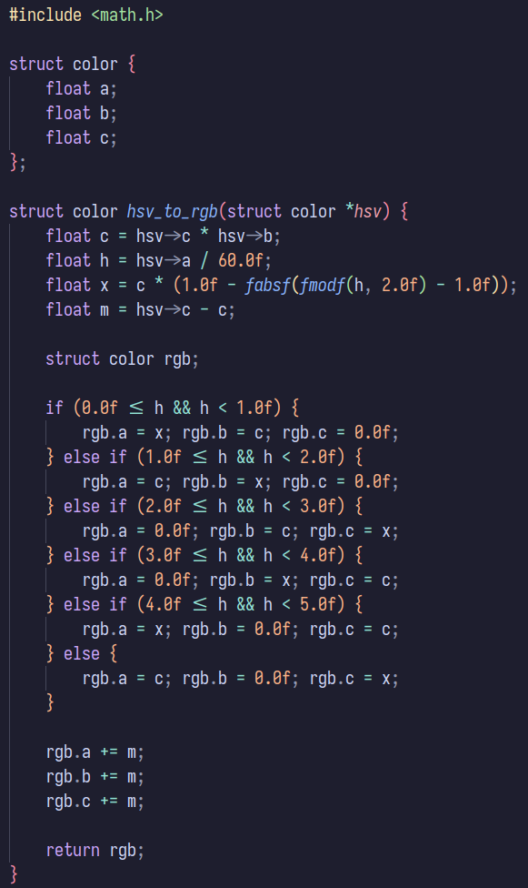
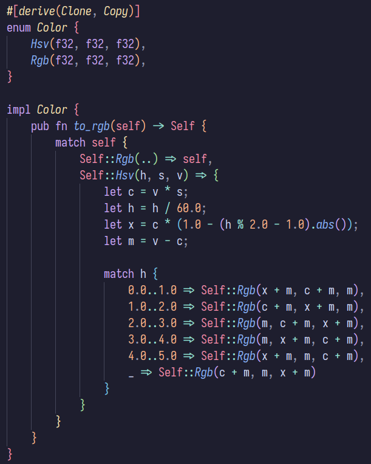

# Learning Diary

Week 2, 13/09/2024  
DTEP 24  
Le Quang Dat

## Foreword

This week's lecture started with a depressing reminder of my current situation.

The ~~beatings~~ design classes will continue until morale improves.

## (and now, the actual diary)

This week's lecture's focus was to really reinforce the notion of design
thinking as not just a business task, but also as a learning process. To design
is to reflect, to relate the designer with the audience. This feels obvious, at
first glance, but I think it's something _so_ obvious it's hard to put into
words, yet so easy for managers to completely overlook in a project with so much
going on. Good design should augment and support users, not hinder and confuse
them. This point is also made extensively during the first few chapters of The
Design of Everyday Things (Norman, 2013), in which the author mentions how
people tend to blame themselves on failing to understand how to use various
objects, when it's the confusing designs that are at fault.

During the lecture, we also got to do an exercise involving noticing potential
problems with a design (in this case, a pavement.) Compared to others, I feel
my observations were nowhere near as detailed (or accurate, for that matter,)
but I think I'll get better at it in time.

I did the RGB LED example in the exercise session, and I must say, the more I
work with C++, the more I miss how Rust, my favorite systems language, makes
writing robust code so much easier. For example, for the color fading, I
implemented an HSV to RGB function to smoothly transition over the color wheel
in Arduino C++ (see Figure 2). The platform doesn't seem to have the STL
available, so this is technically just pure C. But just by looking, it's obvious
that the language is highly verbose, yet some properties are still unclear (for
example, the exact size of a `float`). On the other hand, the Rust
implementation (see Figure 3) is significantly nicer: different color spaces are
now explicit, it's clear how big each color channel is (`f32` is 32 bits wide),
the compiler will ~~yell at~~ tell you if you forget to handle additional color
spaces should they be added, and also if you forget to account for the entire
value range (see the `match h` block) through `match` statements.
Rust is also an expression-based language, so there's no tangled mutation
needed. And because additional compile-time guarantees inherent to the language,
as well as the fact that the compiler is built upon LLVM, compiled Rust binaries
are usually just as fast, if not faster, than equivalent C/C++ code, while
having guaranteed memory safety if (explicitly annotated) `unsafe` code is
absent. All this makes Rust, at least to me, the future of embedded programming,
especially with libraries like Embassy, which provides "unprecedentedly easy and
efficient multitasking in embedded systems" (The Embassy authors, 2019).

{height=90%}

\newpage

## References

1. Norman, D. A. (2013). _The Design of Everyday Things: Revised and
   expanded edition._ Basic Books.
2. The Embassy authors (2019). The Embassy homepage. <https://embassy.dev>.
