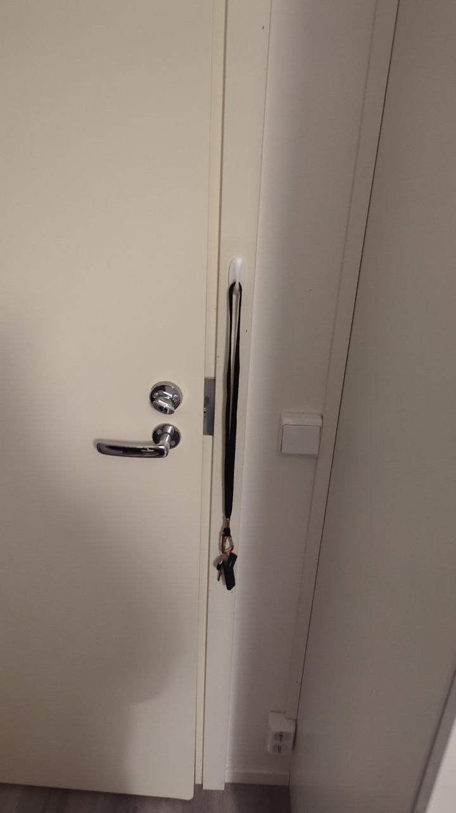
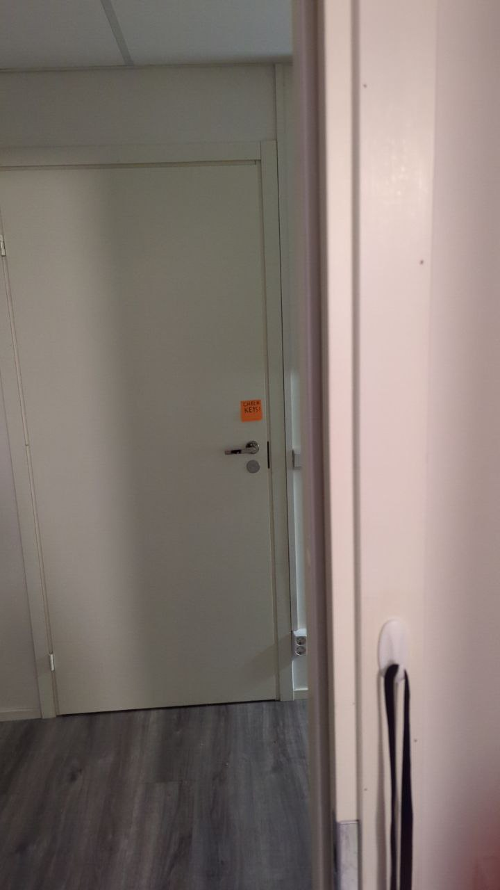
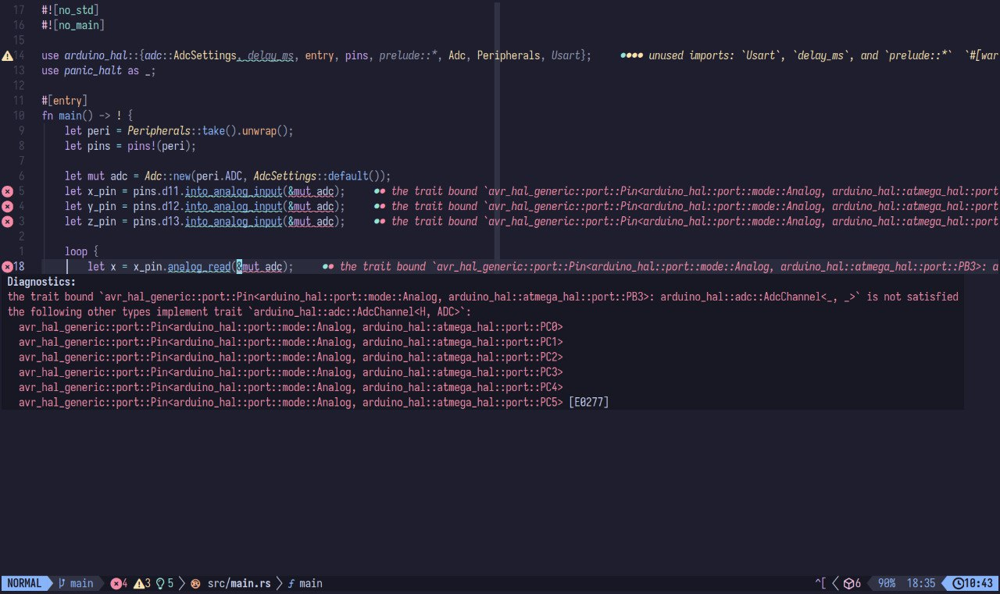
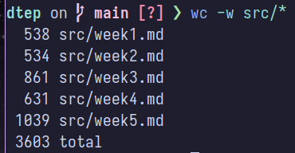

# Learning Diary

Week 5, 04/10/2024  
DTEP 24  
Le Quang Dat

I have... rather strong opinions about trivial, mundane things. _(shocker!)_

Sometimes it's actually _reasonable_. I think it's pretty uncontroversial to
say everyone has things they wish were different, even just a little bit.

But _sometimes_, things just _feel right_, and I get extremely neurotic about
it, and then I go around the place talking about it non-stop, to the point that
I sound like I was actually sponsored. I am _not_, but it _would_ be nice.

Today's entry is all about those things. And a typo I found.

## Keys

I forget my keys a lot. Like, a _lot_.

I tell myself to check that I took it with me when I go outside, and then I
only actually do it when I _am_ outside, _after_ locking the door. And then I
spend the whole day worrying about if my roommate will suddenly go out of town
for the day, and if I'll have to spend the night as a homeless person.

I've had enough. So I put my little meat computer to use: if I keep hanging the
keys on my door, they'll keep being hidden when I open it, which I _have_ to do
anyway to go brush my teeth, and usually I never bother to close it behind me.
Thus, _surely_, if I hang it on the door frame, then it'd never move, and I'd
never forget my keys ever again, right?

So I did! (obligatory See Figure 1™)

{height=30%}

It's even placed _right next to_ the door handle, very naturally appearing in
my line of sight as I put on my clothes and leave my room, appealing as much as
possible to the subconscious brain that's so heavily emphasized by Donald
Norman [1].

Surely, _surely_, **_surely_** I don't lose it again, right?

See Figure 2™.

{height=30%}

_\*sigh\*_

Maybe, _just maybe_, I'll stop forgetting my keys one day.

## Keyboards

Computer history is an endless rabbit hole of triumph, discovery, and...
concessions.

On the one hand, you have people discovering entirely new fields of physics,
mathematics, even art and philosophy with what's essentially rocks that we
somehow taught to think.

On the _other_ hand, you have decisions made decades prior that are so puzzling,
they make you question the sanity of those who made them, the keyboard being one
of the most well-known.

Whoever's tried to teach someone else typing has surely been asked why QWERTY,
the de-facto layout of (most of) the world is so arbitrary and unintuitive.
Turns out, it's actually a concession to accommodate typewriters: the keyboard
actually was in alphabetical order originally, but commonly used letters in
English were too near each other, causing jams; the QWERTY layout was then
created to separate those as much as possible, thus increasing the reliability
of typewriters without increasing cost. And when computers replaced them
entirely, it was too late; even though better layouts have been introduced
since the 1930s, people naturally have enormous resistance to change.

The keyboard was, is, and always will be a classic example of how designers are
perpetually stuck in the crossroads of user needs, technical limitations and
~~capitalism's quest to consume the world whole~~ businesses' desire to save as
much money as possible.

I really should learn Colemak at some point.

## Rust

Ah, my happy place.

Moving on from last week's setup rigmarole, I finally got the chance to write
actual exercise code in Rust, and I had a blast.

I keep talking about Rust's amazing type system and how it prevents bugs, but
I haven't shown much real-world code that makes this clear. Well, during the
exercise session, I encountered what I consider some the most elegant errors
I've ever seen in all my years programming.

{height=30%}

While trying to set up the `USART` peripheral for serial logging, I happened to
mistook the `TX` and `RX` pins with each other (see lines 14 and 15, Figure 3).
On the Arduino Uno, the `TX` pin is located on digital pin 1, and `RX` is on
digital pin 0. However, instead of silently doing something incorrect at
runtime, _without any debugging facilities_ like with C++, this mistake was
caught in Rust using the type system: `Usart::new` requires both the very
specific type `Pin<Input<_>, PD0>` (which is the library's way to declare that
the `RX` pin must be an `Input` pin on physical pin `PD0`), and an owned value
of that type, which by only being obtainable through the `Peripherals` struct,
guarantees that this pin is _exclusively_ used for `USART`, and that it's
properly configured to be an input pin, all without any runtime checks, which
is especially useful on embedded platforms, where code size is scarce, and any
performance improvement is way magnified because of their slow processors.

{height=30%}

As another example, I neglected to carefully read the instructions page [2],
and accidentally used digital pins where I should have used analog pins instead.
Again, instead of turning into a 30-minute debugging session, Rust managed to
catch this mistake, too, with the type system: the trait `AdcChannel`, used to
mark valid pins for use with the `ADC` peripheral, is only implemented for the
MCU's analog pins, and the error message is essentially saying "you're passing
the incorrect pins". Despite the slightly obtuse error text, this library and
the Rust embedded ecosystem in general greatly values compile-time checks and
fast developer feedback, a remarkably effective example of the signifiers
mentioned in _The Design of Everyday Things_ [1].

## Epilogue

That was...

...one and a half times the length of my last one!

Okay!

Apologies for the weird structure in this one, I'm malfunctioning from all the
groceries I got to lug around Espoo this afternoon.

"Boy are my arms tired!" [3]

\newpage

## References

[1] D. Norman, _The Design of Everyday Things: Revised and Expanded Edition_.
Massachusetts, USA: MIT Press, 2013.  
[2] Aalto Wiki Maintainers, _Sensors_. <https://wiki.aalto.fi/display/DTEP/Sensors>
(accessed 04/10/2024)  
[3] D. Gooden, _The Future of TV is Bleak_, <https://youtu.be/6HEheIozS5c>
(accessed 04/10/2024)
