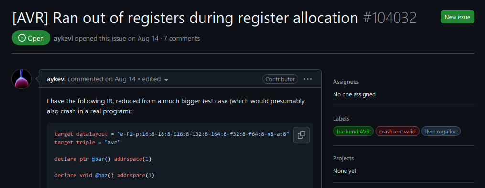
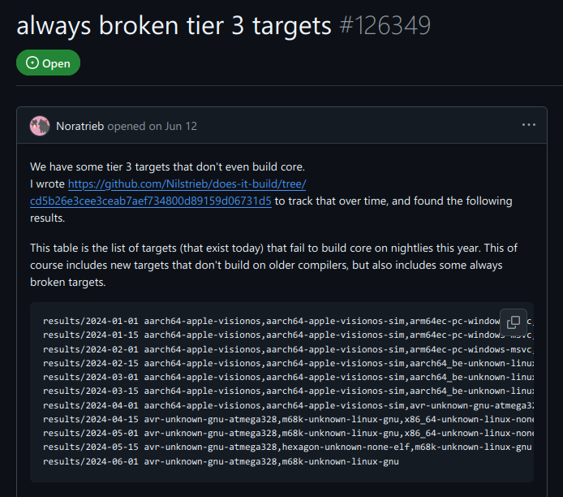

# Learning Diary

Week 5, 04/10/2024  
DTEP 24  
Le Quang Dat

(we have exams next week, so I kinda forgot about the diary. anyway,)

## Life is... good?

You already know how much I love Rust, how much I love the type system, and
especially how much I love the error messages. Most of the time, anyway.

Yet, Rust does not exist in a vacuum, and has to interoperate with a whole
bunch of things that came before: most operating systems and their interfaces
were defined in C, so such is the fate of a language 43 years younger. [1] [2]

And all is well. No, really! Most Rust code is written in pure Rust, except for
`std`, the built-in library available to (almost) [3] every Rust crate, which
inevitably has to talk to the underlying operating systems for functionality
such as the `net` and `sync` modules. And even for the crates that are not in
pure Rust, there is strong ecosystem support for FFI (foreign function
interfaces), such as the `cc` and `cxx` crates for C and C++, respectively.
(In)famous examples for core ecosystem crates using these include `ring` and
`awc-lc-rs`, which provide cryptographic primitives, with the latter being
FIPS-certified, which is a requirement for certain projects. I'm not sure how
I feel about the security-critical core primitives of Rust being written in an
unsafe language, but I digress. Most Rust users work in the `std` environment,
and never has to pay any attention to the ~~powers that be~~ layers underneath.

But as a "wise" maybe-maybe-not-woman once said:

"Thou'rt yet to become me. Thou'rt yet to ~~become a god~~ do embedded Rust." [3]

## oh no

So! Embedded Rust. \*sniff sniff\* _My favorite_.

Let's start simple. The Raspberry Pi Pico is pretty well supported, let's try
building the blink example:

```sh
$ git clone git@github.com:rp-rs/rp-hal --depth 1
Cloning into 'rp-hal'...
remote: Enumerating objects: 316, done.
remote: Counting objects: 100% (316/316), done.
remote: Compressing objects: 100% (273/273), done.
remote: Total 316 (delta 118), reused 125 (delta 28), pack-reused 0 (from 0)
Receiving objects: 100% (316/316), 391.57 KiB | 1.09 MiB/s, done.
Resolving deltas: 100% (118/118), done.
$ cd rp-hal/rp2040-hal-examples
$ cargo b -q
$
```

Seems easy enough. And it even runs! [5]

Alright, the lab has some Arduinos, let's try building something for that:

```sh
$ cargo b -q
error: ran out of registers during register allocation

error: could not compile `core` (lib) due to 1 previous error
error: could not compile `compiler_builtins` (lib) due to 1 previous error
$
```

Oh. Oh no. What _is_ this error? Searching around led me to discover this issue
in the Rust issues page [6]:




It's an 2-month old LLVM issue. _2 months_. We're in experimental territory now.

Asking for advice on the Rust Embedded Matrix chat, I got an advice to build in
release mode.

Here we go:

```sh
$ cargo b -q
$
```

Huh, it works! I don't have hardware with me to test, but it's just blinky.
Let's build a more sophisticated program to test, say, the UART task? [7]

```rust
#![no_std]
#![no_main]

use core::{convert::Infallible, iter, str};

use arduino_hal::{default_serial, entry, pins, prelude::*, Peripherals};
use heapless::Vec;
use nb::block;
use panic_halt as _;
use ufmt::uwriteln;

#[entry]
fn _start() -> ! {
    let _ = main();

    #[allow(clippy::empty_loop)]
    loop {}
}

fn main() -> Result<(), Infallible> {
    // SAFETY: we only run this once on init
    let peri = unsafe { Peripherals::steal() };
    let pins = pins!(peri);

    let mut serial = default_serial!(peri, pins, 115_200);
    let mut cur_id = 0;

    // trig must be pulled down to GND
    let trig = pins.d2;
    let mut held = false;

    loop {
        match trig.is_high() {
            true if !held => {
                held = true;

                // send the initial ping
                uwriteln!(serial, "send {}", cur_id)?;

                // verify and sync
                loop {
                    // read an entire line, up to 32 bytes
                    let msg = iter::repeat_with(|| block!(serial.read()))
                        .map_while(Result::ok)
                        .take_while(|b| *b != b'\n')
                        .take(32)
                        .collect::<Vec<_, 32>>();

                    let mut parts = msg.split(|b| *b == b' ');
                    if parts
                        .next()
                        .filter(|s| [&b"recv"[..], &b"sync"[..]].contains(s))
                        .zip(
                            parts
                                .next()
                                .and_then(|s| str::from_utf8(s).ok())
                                .and_then(|s| s.parse::<u32>().ok())
                                .filter(|id| *id == cur_id),
                        )
                        .is_none()
                    {
                        // malformed message, try resync
                        uwriteln!(serial, "sync {}", cur_id)?;
                        continue;
                    };

                    break;
                }

                cur_id += 1;
            }
            false => held = false,
            _ => {}
        }
    }
}
```

This code [8] sends and receives pings from a peer, using a simple string-based
wire protocol.

Let's gooooooo:

```sh
$ cargo br -q --bin uart-tx
error: linking with `avr-gcc` failed: exit status: 1
  |
  = note: /usr/bin/avr-ld: /home/flippette/documents/repos/dtep-ex/target/avr-unknown-gnu-atmega328/release/deps/uart_rx-0e641fa7248496f0.uart_rx.e3d66d8c950d2cc0-cgu.0.rcgu.o: in function `uart_rx::__avr_device_rt__start':
          uart_rx.e3d66d8c950d2cc0-cgu.0:(.text._ZN7uart_rx22__avr_device_rt__start17hd5c6c9d5beecd813E+0xd8): undefined reference to `memcpy'
          /usr/bin/avr-ld: uart_rx.e3d66d8c950d2cc0-cgu.0:(.text._ZN7uart_rx22__avr_device_rt__start17hd5c6c9d5beecd813E+0x150): undefined reference to `memcmp'
          /usr/bin/avr-ld: uart_rx.e3d66d8c950d2cc0-cgu.0:(.text._ZN7uart_rx22__avr_device_rt__start17hd5c6c9d5beecd813E+0x504): undefined reference to `abort'
          collect2: error: ld returned 1 exit status

  = note: some `extern` functions couldn't be found; some native libraries may need to be installed or have their path specified
  = note: use the `-l` flag to specify native libraries to link
  = note: use the `cargo:rustc-link-lib` directive to specify the native libraries to link with Cargo (see https://doc.rust-lang.org/cargo/reference/build-scripts.html#rustc-link-lib)

error: could not compile `dtep-ex` (bin "uart-rx") due to 1 previous error
```

Uhh...

What? What even _is_ this? `memcpy`, `memcmp` and `abort` are symbols from the
`compiler_builtins` crate, an even lower-level crate than `std`, available for
every Rust program, so how is it even possible that they're missing? We're even
building it from source, it _just_ came out of the oven, what do you _mean_
they're missing???

<omitted from this entry is around 4 days of pain trying to figure it out>

Alright, I give up. My setup has something wrong somewhere. Luckily, `avr-hal` [9]
provides some target files. Blinky worked, surely this isn't the problem, right?

```sh
$ cargo br -q --bin uart-tx --target avr-atmega328p.json
$
```

...

WHAT???

To say that I was confused would be an understatement. Is the built-in target
just broken? What even is different between it and this custom one?

```sh
$ diff avr-atmega328p.json avr-unknown-gnu-atmega328.json
4c4
<   "cpu": "atmega328p",
---
>   "cpu": "atmega328",
7a8
>   "env": "gnu",
8a10
>   "is-builtin": true,
23d24
<   "no-default-libraries": false,
25,26c26,27
<     "gnu-cc": ["-mmcu=atmega328p", "-Wl,--as-needed,--print-memory-usage"],
<     "gnu-lld-cc": ["-mmcu=atmega328p", "-Wl,--as-needed,--print-memory-usage"]
---
>     "gnu-cc": ["-mmcu=atmega328"],
>     "gnu-lld-cc": ["-mmcu=atmega328"]
```

The `atmega328` chip _should_ be compatible with the `atmega328p`, and the rest
of the target file didn't seem to have much significant difference either.
What? Looking through the Rust issues once again, I found this [10]:



_\*sigh\*_

The design of this low-level tooling, while occasionally opaque and unhelpful,
like the status quo of machines-are-not-people [11], were designed in the olden
days, where people just kind of sucked it up. Maybe, just maybe, things will
get better one day.

"God damn compilers are way too hard." [12]

\newpage

## References

[1] Wikipedia editors, _C (programming language)_,
<https://en.wikipedia.org/wiki/C_(programming_language)> (accessed Oct 13, 2024)  
[2] Wikipedia editors, _Rust (programming language)_,
<https://en.wikipedia.org/wiki/Rust_(programming_language)> (accessed Oct 13, 2024)  
[3] The Rust Embedded team, _A `no_std` Rust Environment_,
<https://docs.rust-embedded.org/book/intro/no-std.html> (accessed Oct 13, 2024)  
[4] Elden Ring Fandom maintainers, _Radagon of the Golden Order_,
<https://eldenring.fandom.com/wiki/Radagon_of_the_Golden_Order> (accessed Oct 13, 2024)  
[5] Dat L., _blink_ <https://streamable.com/g6h9v9> (accessed Oct 13, 2024)  
[6] The Rust team, _"error: ran out of registers during register allocation" for
absolutely minimal attiny85 program"_,
<https://github.com/rust-lang/rust/issues/108232> (accessed Oct 13, 2024)  
[7] Aalto Wiki maintainers, _UART Bus_,
<https://wiki.aalto.fi/display/DTEP/UART+bus> (accessed Oct 13, 2024)  
[8] Dat L., _`dtep-ex`_, <https://github.com/flippette/dtep-ex> (accessed Oct 13, 2024)  
[9] Rahix, _`avr-hal`_, <https://github.com/Rahix/avr-hal> (accessed Oct 13, 2024)  
[10] The Rust team, _always broken tier 3 targets_,
<https://github.com/rust-lang/rust/issues/126349> (accessed Oct 13, 2024)  
[11] D. Norman, _The Design of Everyday Things: Revised and Expanded Edition_.
Massachusetts, USA: MIT Press, 2013.  
[12] Desires A., _Compiler Optimizations Are Hard Because They Forget_,
<https://faultlore.com/blah/oops-that-was-important> (accessed Oct 13, 2024)
